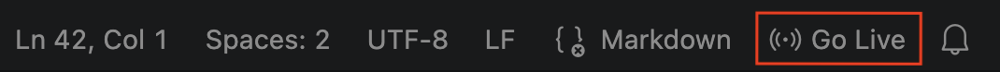

# Web 2 — Séance 05
## Query Selector

---

# Partie 2 : Frontend "old school"
##

- **Backend** = serveur, manipule les données
- **Frontend** = client, définit l'interface utilisateur

Old school : HTML + CSS + JS dans le navigateur, sans framework. <br>
Le JavaScript permet de rendre la page dynamique et interactive.

---

# Serveur Frontend

- Serveur web de fichiers statiques
- Reçoit des requêtes HTTP du navigateur demandant des fichiers statiques
  - L'utilisateur accède à http://localhost:5500/page.html dans son navigateur &rarr; Le navigateur envoie une requête GET /page.html
  - Le serveur renvoie le fichier correspondant au navigateur
  - Si le fichier fait référence à d'autres fichiers (`<link>` pour le CSS ou les polices, `<script>` pour le JavaScript, `` pour les images, …), le navigateur fait d'autres requêtes HTTP pour les récupérer
  - Si l'URL fait référence à un dossier (`/`, `/admin`, …), le serveur renvoie le fichier `index.html` de ce dossier
  - Si le fichier demandé n'existe pas, le serveur renvoie une erreur 404
- Le navigateur interprète le HTML, applique le CSS et exécute le JS pour afficher la page
  - &rarr; Le code est exécuté **dans le navigateur**, pas sur le serveur
  - &rarr; La console se trouve dans les outils de développement du navigateur (F12)

---

# Serveur de développement avec Live Server

- Extension VSCode : Live Server
- Permet de lancer un serveur web de fichiers statiques
- Permet de recharger automatiquement la page dans le navigateur quand un fichier est modifié



- Cliquez sur le bouton "Go Live" en bas à droite de VSCode pour lancer le serveur
- Sert les fichiers du projet ouvert dans VSCode, avec la structure de dossiers du projet
- Port par défaut : 5500 (http://localhost:5500)

---

# Le DOM (Document Object Model)

Le DOM est une représentation en arbre de votre HTML

```html
<html>
  <body>
    <div id="app">
      <h1>MiamMiam</h1>
      <div class="recipe-card">
        <h2>Pâtes Carbonara</h2>
      </div>
    </div>
  </body>
</html>
```

**JavaScript peut accéder et modifier chaque nœud :**
- Lire les propriétés
- Modifier le contenu
- Ajouter/Supprimer des éléments
- Écouter les événements

---

# JavaScript dans le navigateur

- Le navigateur est capable d'exécuter du JavaScript (pas du TypeScript!)
- Le code JS peut être inclus dans la page HTML avec `<script>` ou chargé depuis un fichier externe
- Le code JS doit s'exécuter **après le chargement du DOM** : `<script>` en fin de `<body>`, ou dans `<head>` avec l'attribut `defer`

```html
<script src="script.js"></script>
<script>
  console.log("Hello world!");
</script>
```

JavaScript VS TypeScript :
- Pas de typage statique, pas d'interfaces
- Pas de compilation : le fichier est exécuté tel quel

Le code JS est exécuté **dans le navigateur**, pas sur le serveur. <br>
&rarr; la console se trouve dans les outils de développement du navigateur (F12).

---

# document.querySelector()

Sélectionner **un seul** élément

```js
// Par ID
const app = document.querySelector('#app');

// Par classe
const card = document.querySelector('.recipe-card');

// Par tag
const titre = document.querySelector('h1');

// Sélecteur CSS complexe
const firstRecipe = document.querySelector('div.recipe-card > h2');

// Par attribut
const input = document.querySelector('input[type="email"]');
```

**Retourne:** l'élément trouvé ou `null`

---

# document.querySelectorAll()

Sélectionner **plusieurs** éléments

```js
// Toutes les cartes de recettes
const cards = document.querySelectorAll('.recipe-card');

// Tous les h2 dans les cartes
const titles = document.querySelectorAll('.recipe-card h2');

// Tous les boutons
const buttons = document.querySelectorAll('button');
```

**Retourne:** une `NodeList` (pas un Array!)

```js
// Parcourir une NodeList
cards.forEach(card => {
  console.log(card.textContent);
});

// Convertir en Array si nécessaire
const cardsArray = Array.from(cards);
```

---

# Lire les propriétés des éléments

```js
const card = document.querySelector('.recipe-card');

// textContent: le texte uniquement
console.log(card.textContent); // "Pâtes Carbonara"

// innerHTML: le HTML à l'intérieur
console.log(card.innerHTML); // "<h2>Pâtes Carbonara</h2><p>..."

// value: pour inputs, selects, textarea
const input = document.querySelector('input');
console.log(input.value); // "ma recherche"

// classList: les classes de l'élément
console.log(card.classList); // DOMTokenList
console.log(card.classList.contains('favorite')); // true/false

// Attributs
console.log(card.getAttribute('data-id')); // "123"
console.log(card.dataset.id); // "123" — raccourci pour les attributs data-*
console.log(card.id); // lecture directe
console.log(card.className); // lecture directe
```

---

# Modifier les éléments

```js
const card = document.querySelector('.recipe-card');

// Modifier le texte
card.textContent = 'Nouilles Carbonara';

// Modifier le HTML (attention: danger XSS!)
card.innerHTML = '<h2>Pâtes Carbonara</h2><p>5 min</p>';

// Ajouter une classe
card.classList.add('favorite');

// Retirer une classe
card.classList.remove('favorite');

// Basculer une classe
card.classList.toggle('favorite');

// Modifier le style inline
card.style.backgroundColor = '#ffeb3b';
card.style.padding = '20px';
card.style.display = 'none';

// Modifier un attribut
card.setAttribute('data-likes', '42');
```

---

# Créer des éléments

```js
// Créer un nouvel élément
const newCard = document.createElement('div');
newCard.className = 'recipe-card';

// Lui donner du contenu
newCard.textContent = 'Pâtes à la Bolognaise';

// Ou avec du HTML
newCard.innerHTML = `
  <h2>Pâtes à la Bolognaise</h2>
  <p>Préparation: 30 min</p>
  <button>Ajouter</button>
`;

// Définir des attributs
newCard.setAttribute('data-id', '456');
newCard.style.borderRadius = '8px';
```

Attention: l'élément existe en mémoire mais **pas encore dans la page!**

---

# Ajouter au DOM

```js
const newCard = document.createElement('div');
newCard.innerHTML = '<h2>Risotto</h2>';

const container = document.querySelector('#recipes-container');

// appendChild: ajoute en dernier enfant
container.appendChild(newCard);

// append: ajoute en dernier (supporte plusieurs éléments et du texte)
container.append(newCard, 'texte additionnel');
// Un élément n'est jamais à deux endroits : l'ajouter ailleurs le déplace

// insertBefore: insère avant un élément référence
const firstCard = document.querySelector('.recipe-card');
container.insertBefore(newCard, firstCard);
```

Après ces méthodes, l'élément est **visible dans la page!**

---

# Supprimer des éléments

```js
const card = document.querySelector('.recipe-card');

// Méthode moderne: remove()
card.remove();

// Méthode classique: removeChild()
const parent = card.parentElement;
parent.removeChild(card);
```

---

# Exemple: Afficher une liste de recettes

```js
const recipes = [
  { id: 1, title: 'Pâtes Carbonara', duration: 15 },
  { id: 2, title: 'Risotto', duration: 30 },
  { id: 3, title: 'Soupe Gratinée', duration: 45 }
];

const container = document.querySelector('#recipes');

recipes.forEach(recipe => {
  const card = document.createElement('div');
  card.className = 'recipe-card';

  card.innerHTML = `
    <h2>${recipe.title}</h2>
    <p>⏱️ ${recipe.duration} min</p>
    <button data-recipe-id="${recipe.id}">Voir</button>
  `;

  container.appendChild(card);
});
```

Résultat: 3 cartes de recettes dans la page!

---

# Template Literals pour HTML

```js
const recipe = { title: 'Pâtes', duration: 15, rating: 4.5 };

const html = `
  <div class="recipe-card">
    <h2>${recipe.title}</h2>
    <p>⏱️ ${recipe.duration} min</p>
    <p>⭐ ${recipe.rating}/5</p>
  </div>
`;

document.querySelector('#app').innerHTML = html;
```

**Attention au XSS (Cross-Site Scripting):**

```js
// DANGER! Si recipe.title vient d'un utilisateur
const malicious = '';
document.querySelector('#app').innerHTML = `<h2>${malicious}</h2>`; // Script exécuté!

// Solution: utiliser textContent pour les données utilisateur
const card = document.createElement('div');
card.textContent = malicious; // Affiché littéralement, pas exécuté
```

Utilisez `innerHTML` pour le HTML structuré, `textContent` pour les données potentiellement dangereuses.

---

# Récapitulatif

- **Web statique** : HTML + CSS + JS, servi par un serveur web
- **DOM** : représentation en arbre du HTML, manipulable avec JS
- **JS dans le navigateur** : `<script>` ou fichier externe, exécuté après le chargement du DOM

| Opération | Méthode |
|-----------|---------|
| Sélectionner un | `querySelector()` |
| Sélectionner plusieurs | `querySelectorAll()` |
| Créer un élément | `createElement()` |
| Ajouter au DOM | `appendChild()`, `append()` |
| Supprimer | `remove()`, `removeChild()` |

---

# Récapitulatif (suite)

| Opération | Méthode |
|-----------|---------|
| Lire texte | `textContent` |
| Lire/modifier HTML | `innerHTML` |
| Modifier classes | `classList.add/remove/toggle()` |
| Modifier style | `style.property = value` |

**Prochaine séance** : Séance 06 — Gestion d'événements (click, input, submit...)

---

# Exercice complémentaire EC01

1. Téléchargez la page HTML de la séance 05 sur moodle et placez-la dans votre dossier de cours
2. Créez un fichier `script.js` et liez-le à la page HTML
3. Dans `script.js`, affichez dans la console le texte du titre `h1`
4. Modifiez le texte du titre `h2` en "Recette modifiée"
5. Ajoutez un nouveau paragraphe `<p>` avec le texte "Temps de préparation : 30 min" à la fin de la carte de recette
6. Déclarez un tableau `recipes` de 4 recettes (`id`, `title`, `duration`) et affichez une carte (`div.recipe-card`) par recette dans le conteneur `#recipes` : titre, durée et un bouton "Voir" portant l'id de la recette dans un attribut `data-id`
7. Affichez le nombre de recettes dans l'élément `#count`
8. **Optionnel** : ajoutez une classe `quick` aux cartes dont la durée est inférieure ou égale à 20 minutes (regardez le CSS de la page)
