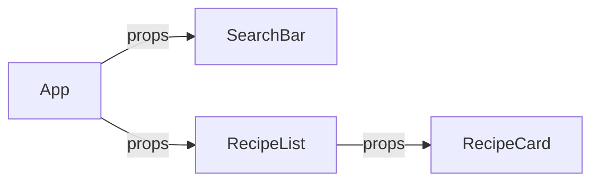
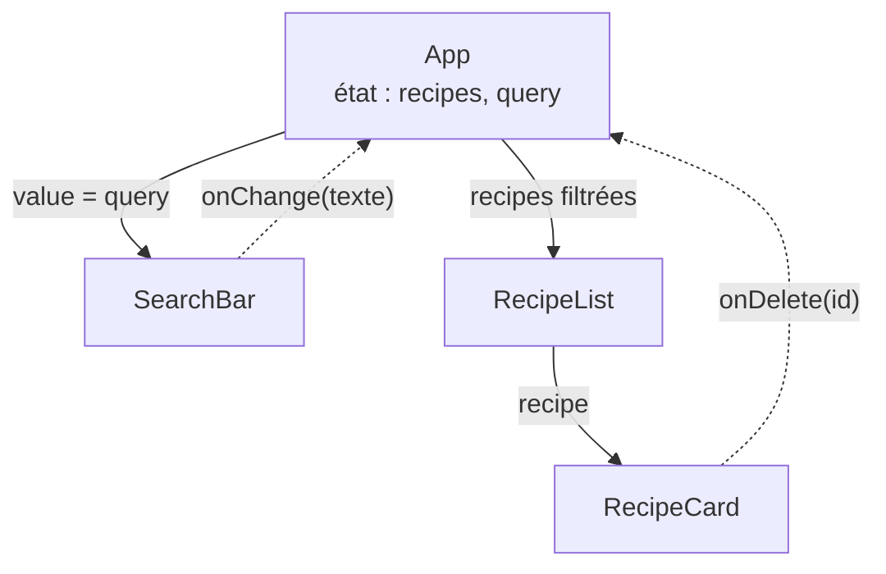

# Web 2 — Séance 14
## État partagé

---

# Le problème : deux composants, une donnée
##

On veut une barre de recherche qui filtre la liste des recettes.

```tsx
const SearchBar = () => {
  const [query, setQuery] = useState("");
  return <TextField value={query} onChange={(e) => setQuery(e.target.value)} />;
};

const RecipeList = ({ recipes }: RecipeListProps) => {
  // Comment connaître query ?
};

const App = () => (
  <>
    <SearchBar />
    <RecipeList recipes={recipes} />
  </>
);
```

- L'état `query` est **local** à `SearchBar` : aucun autre composant ne peut le lire
- `SearchBar` et `RecipeList` sont **frères** : aucun ne peut passer de props à l'autre

---

# Flux de données unidirectionnel
##

En React, les données circulent **dans un seul sens** :

- Du parent vers l'enfant, par les **props**
- Un enfant ne peut ni lire l'état de son parent, ni celui de ses frères, sauf si on le lui passe en prop

<br>



**Conséquence** : si deux composants doivent partager une donnée, il faut la stocker dans leur **plus proche parent commun**.

---

# Remonter l'état (lifting state up)

1. Identifier les composants qui ont besoin de la donnée : `SearchBar` et `RecipeList`
2. Trouver leur **plus proche parent commun** : `App`
3. Y déplacer l'état
4. Passer la **valeur** aux enfants qui la lisent, et une **fonction** à ceux qui la modifient

```tsx
const App = () => {
  const [recipes, setRecipes] = useState<Recipe[]>(initialRecipes);
  const [query, setQuery] = useState("");

  const filteredRecipes = recipes.filter((recipe) =>
    recipe.title.toLowerCase().includes(query.toLowerCase())
  );

  return (
    <>
      <SearchBar value={query} onChange={setQuery} />
      <RecipeList recipes={filteredRecipes} />
    </>
  );
};
```

---

# Une prop peut être une fonction
##

L'état `recipes` est dans `App`, mais le bouton « Supprimer » est dans `RecipeCard`. Seul `App` peut appeler `setRecipes`.

- En JavaScript, une fonction est une **valeur** comme une autre
- On peut la stocker dans une variable ou la passer en argument
- Elle peut donc aussi être passée en **prop**
- Le parent crée une fonction qui modifie **son** état, et la donne à l'enfant
- L'enfant l'appelle quand l'événement se produit, sans savoir ce qu'elle fait

---

# Une prop peut être une fonction (suite)

```tsx
interface RecipeCardProps {
  recipe: Recipe;
  onDelete: (id: number) => void; // type d'une fonction : paramètres => type de retour
}

const RecipeCard = ({ recipe, onDelete }: RecipeCardProps) => (
  <Card>
    {/* ... */}
    <Button color="error" onClick={() => onDelete(recipe.id)}>Supprimer</Button>
  </Card>
);
```

- `(id: number) => void` : une fonction qui reçoit un nombre et ne retourne rien
- Convention : `onXxx` pour la prop, comme `onClick` ou `onChange` (séance 12)

---

# Le parent fournit la fonction

```tsx
const App = () => {
  const [recipes, setRecipes] = useState<Recipe[]>(initialRecipes);

  const deleteRecipe = (id: number) => {
    setRecipes(recipes.filter((recipe) => recipe.id !== id));
  };

  return <RecipeList recipes={recipes} onDelete={deleteRecipe} />;
};
```

```tsx
interface RecipeListProps {
  recipes: Recipe[];
  onDelete: (id: number) => void;
}

const RecipeList = ({ recipes, onDelete }: RecipeListProps) => (
  <Grid container spacing={2}>
    {recipes.map((recipe) => (
      <Grid key={recipe.id} size={{ xs: 12, sm: 6, md: 4 }}>
        <RecipeCard recipe={recipe} onDelete={onDelete} /> {/* transmise telle quelle */}
      </Grid>
    ))}
  </Grid>
);
```

---

# Déroulement d'une suppression

```
1. App         crée deleteRecipe, qui utilise setRecipes
               <RecipeList onDelete={deleteRecipe} />
2. RecipeList  reçoit onDelete et le transmet à chaque carte
               <RecipeCard recipe={recette 3} onDelete={onDelete} />
3. Clic sur « Supprimer » de la recette 3
               onDelete(3) → c'est deleteRecipe(3), la fonction de App, qui s'exécute
4. App         setRecipes(nouveau tableau sans la recette 3) → nouveau rendu de App
5. RecipeList  reçoit le nouveau tableau → la carte 3 n'est plus affichée
```

- L'**état** ne quitte jamais `App` : seule la fonction voyage vers le bas
- L'**événement** remonte : l'enfant signale « supprimer la 3 », le parent décide quoi faire
- `RecipeCard` est réutilisable : ailleurs, `onDelete` pourrait faire autre chose (demander une confirmation, appeler le serveur…)

---

# Exemple : ajouter depuis le formulaire

```ts
// models/recipe.ts
export type NewRecipe = Omit<Recipe, "id" | "authorId">; // Recipe sans id ni authorId
```

```tsx
// RecipeForm.tsx
interface RecipeFormProps {
  onAdd: (recipe: NewRecipe) => void;
}

const RecipeForm = ({ onAdd }: RecipeFormProps) => {
  const handleSubmit = (event: SubmitEvent<HTMLFormElement>) => {
    event.preventDefault();
    onAdd({ title: form.title, prepTime: Number(form.prepTime), /* ... */ });
    setForm(initialForm);
  };
  // ...
};
```

```tsx
// App.tsx : c'est le parent qui complète la recette et modifie la liste
const addRecipe = (newRecipe: NewRecipe) => {
  const recipe: Recipe = { ...newRecipe, id: Date.now(), authorId: 1 }; // authorId fictif pour l'instant
  setRecipes([...recipes, recipe]);
};

<RecipeForm onAdd={addRecipe} />
```

---

# Un composant contrôlé par son parent

```tsx
interface SearchBarProps {
  value: string;
  onChange: (value: string) => void;
}

const SearchBar = ({ value, onChange }: SearchBarProps) => {
  return (
    <TextField
      label="Rechercher une recette"
      value={value}
      onChange={(e) => onChange(e.target.value)}
      fullWidth
    />
  );
};
```

- Même mécanisme que `onDelete`, appliqué à un champ de saisie
- `SearchBar` n'a **plus d'état** : elle affiche ce qu'on lui donne et signale les changements
- C'est exactement le principe d'un champ contrôlé (séance 12) : `value` + `onChange`, appliqué à **notre** composant
- On peut passer directement le setter (`onChange={setQuery}`) : ses types correspondent

---

# Les données descendent, les événements remontent



- Flèches pleines : props (données)
- Flèches pointillées : appels de fonctions reçues en props (événements)
- **Une seule source de vérité** : chaque donnée est stockée à un seul endroit
- Pour savoir pourquoi l'affichage a changé, il suffit de chercher qui appelle le setter

---

# État ou valeur dérivée ?

`filteredRecipes` n'est **pas** un état : il se calcule à partir de `recipes` et `query`.

```tsx
// ❌ Deux états qui doivent rester synchronisés à la main
const [recipes, setRecipes] = useState<Recipe[]>(initialRecipes);
const [filteredRecipes, setFilteredRecipes] = useState<Recipe[]>(initialRecipes);
// Ajouter une recette : penser à mettre à jour les deux...

// ✅ Un état, une valeur déduite à chaque rendu
const [recipes, setRecipes] = useState<Recipe[]>(initialRecipes);
const filteredRecipes = recipes.filter(/* ... */);
```

Question à se poser avant de créer un état : **peut-on le calculer** à partir des props ou d'un autre état ? Si oui, ce n'est pas un état.

---

# Plusieurs filtres combinés

```tsx
const App = () => {
  const [recipes, setRecipes] = useState<Recipe[]>(initialRecipes);
  const [query, setQuery] = useState("");
  const [categoryId, setCategoryId] = useState<number | null>(null);

  const filteredRecipes = recipes.filter((recipe) => {
    const text = `${recipe.title} ${recipe.description}`.toLowerCase();
    if (!text.includes(query.toLowerCase())) return false;
    if (categoryId !== null && recipe.categoryId !== categoryId) return false;
    return true;
  });

  return (
    <>
      <SearchBar value={query} onChange={setQuery} />
      <CategoryFilter selectedId={categoryId} onSelect={setCategoryId} />
      <Typography>{filteredRecipes.length} recette(s)</Typography>
      <RecipeList recipes={filteredRecipes} onDelete={deleteRecipe} />
    </>
  );
};
```

`null` représente « toutes les catégories ».

---

# Exemple : CategoryFilter

```tsx
interface CategoryFilterProps {
  selectedId: number | null;
  onSelect: (categoryId: number | null) => void;
}

const CategoryFilter = ({ selectedId, onSelect }: CategoryFilterProps) => {
  return (
    <Stack direction="row" spacing={1}>
      <Chip
        label="Toutes"
        color={selectedId === null ? "primary" : "default"}
        onClick={() => onSelect(null)}
      />
      {categories.map((category) => (
        <Chip
          key={category.id}
          label={category.name}
          color={selectedId === category.id ? "primary" : "default"}
          onClick={() => onSelect(category.id)}
        />
      ))}
    </Stack>
  );
};
```

---

# Où placer un état ?

- Un seul composant l'utilise &rarr; **état local** de ce composant
  - Ouverture d'un menu, champ en cours de saisie, nombre de portions affiché
- Plusieurs composants l'utilisent &rarr; dans leur **plus proche parent commun**
  - Recherche, filtres, liste des recettes, favoris affichés à plusieurs endroits
- Le plus bas possible : un état remonté trop haut provoque des rendus inutiles et des props en cascade

```tsx
// ✅ État local : personne d'autre n'a besoin de savoir si les étapes sont affichées
const RecipeDetail = ({ recipe }: RecipeDetailProps) => {
  const [showSteps, setShowSteps] = useState(true);
  // ...
};
```

---

# Limite : les props en cascade

Quand le parent commun est très haut dans l'arbre, les props traversent des composants qui n'en ont pas besoin.

```
App (état : user)
└── PageLayout        user ← ne l'utilise pas, le transmet
    └── Header        user ← ne l'utilise pas, le transmet
        └── UserMenu  user ← l'utilise enfin
```

- On parle de **prop drilling**
- Supportable sur 2 ou 3 niveaux, pénible au-delà : chaque composant intermédiaire doit déclarer et transmettre la prop
- Solution en séance 17 : **React Context**

---

# Récapitulatif Séance 14

- **Flux unidirectionnel** — Les données descendent par les props
- **Lifting state up** — L'état partagé est placé dans le plus proche parent commun
- **Composant contrôlé** — `value` + `onChange` pour nos propres composants
- **Fonction en prop** — Le parent passe `onAdd`, `onDelete`… ; l'enfant les appelle, le parent modifie son état
- **Événements vers le haut** — L'enfant signale ce qui s'est passé, le parent décide quoi faire
- **Source de vérité unique** — Chaque donnée est stockée à un seul endroit
- **Valeurs dérivées** — Filtrage et compteurs calculés pendant le rendu
- **Placement** — Le plus bas possible, là où tous les utilisateurs de la donnée y ont accès
- **Prop drilling** — Props transmises à travers des composants qui ne les utilisent pas

**Prochaine séance** : Séance 15 — Routage

---

# Exercice filé S14 partie 1

La liste des recettes devient un état de `App`, modifié par le formulaire et par les cartes.

1. Dans `App`, créez un état `recipes` initialisé avec le module `data/recipes` ; `RecipeList` ne lit plus le module elle-même, elle reçoit les recettes en prop
2. Ajoutez le type `NewRecipe` dans `models/recipe.ts`
3. Ajoutez à `RecipeForm` une prop `onAdd: (recipe: NewRecipe) => void` : à la soumission valide, le formulaire appelle `onAdd` avec la recette (champs numériques convertis, `tags` vide) au lieu de l'afficher dans la console
4. Dans `App`, écrivez `addRecipe` : elle complète la recette (id généré, `authorId` à 1 pour l'instant) et l'ajoute à l'état ; passez-la à `RecipeForm`
5. Ajoutez à `RecipeCard` une prop `onDelete: (id: number) => void` et un bouton « Supprimer » qui l'appelle ; `RecipeList` reçoit aussi `onDelete` et le transmet à chaque carte
6. Dans `App`, écrivez `deleteRecipe` et passez-la à `RecipeList`
7. Vérifiez qu'une recette ajoutée apparaît dans la liste et peut être supprimée, puis rechargez la page : pourquoi retrouve-t-on la liste de départ ?

---

# Exercice filé S14 partie 2

1. Créez un composant `SearchBar` contrôlé par `App` (props `value` et `onChange`) ; la recherche porte sur le titre et la description, sans tenir compte des majuscules
2. Créez un composant `CategoryFilter` qui affiche un `Chip` par catégorie et un `Chip` « Toutes »
3. Dans `App`, calculez la liste filtrée à partir de la liste des recettes, de la recherche et de la catégorie choisie ; affichez le nombre de résultats
4. Si aucune recette ne correspond, affichez un message et un bouton qui réinitialise les filtres
5. Remontez l'état des favoris : `App` stocke les ids des recettes favorites (`number[]`) ; `FavoriteButton` devient un composant contrôlé (`isFavorite`, `onToggle`)
6. Affichez le nombre de favoris dans l'en-tête de `PageLayout`
7. **Optionnel** : ajoutez un filtre « Favoris uniquement » (case à cocher ou `Chip`)
