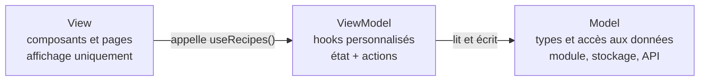

# Web 2 — Séance 19
## Structure de l'application

---

# Le problème : des composants qui font tout

Après 12 séances, `App` et les pages mélangent plusieurs responsabilités :

```tsx
const App = () => {
  const [recipes, setRecipes] = useState<Recipe[]>(initialRecipes);
  const [favoriteIds, setFavoriteIds] = useState<number[]>(() => loadFavorites());

  useEffect(() => saveFavorites(favoriteIds), [favoriteIds]);

  const addRecipe = (newRecipe: NewRecipe) => { /* ... */ };
  const deleteRecipe = (id: number) => { /* ... */ };
  const toggleFavorite = (id: number) => { /* ... */ };

  return (/* 40 lignes de routes */);
};
```

- **Données** : d'où viennent les recettes ? (module, stockage, bientôt API)
- **Logique** : comment ajoute-t-on une recette, un favori ?
- **Affichage** : quels composants, quelle mise en page ?

Changer la source des données (Partie 4) obligerait à modifier les composants d'affichage.

---

# Séparation des responsabilités

Principe déjà appliqué dans le backend :

```
Backend :   Controller  →  Service  →  FilesService  →  data/*.json
            (HTTP)         (métier)    (accès aux données)
```

- Chaque couche a **une seule raison de changer**
- Remplacer les fichiers JSON par une base de données ne touche pas aux contrôleurs

Le même principe s'applique au frontend :

- Les composants **affichent** et transmettent les actions de l'utilisateur
- La **logique** et l'**accès aux données** sont ailleurs

---

# Le modèle MVVM

**Model – View – ViewModel**, adapté à React :



- **Model** : forme des données (`models/`) et fonctions d'accès (`data/`, `utils/storage.ts`, `services/` en Partie 4)
- **ViewModel** : hooks qui exposent à la vue un **état prêt à afficher** et des **actions** (`addRecipe`, `toggleFavorite`)
- **View** : composants qui appellent un hook, affichent le résultat et appellent les actions ; aucun `useState` de données, aucun accès direct au stockage

---

# Hook personnalisé

Un **hook personnalisé** est une fonction :

- Dont le nom commence par `use`
- Qui appelle d'autres hooks (`useState`, `useEffect`, `useParams`…)
- Qui retourne ce dont le composant a besoin

```ts
// hooks/useFavorites.ts
export const useFavorites = () => {
  const [favoriteIds, setFavoriteIds] = useState<number[]>(() => loadFavorites());

  useEffect(() => saveFavorites(favoriteIds), [favoriteIds]);

  const toggleFavorite = (recipeId: number) =>
    setFavoriteIds((prev) =>
      prev.includes(recipeId) ? prev.filter((id) => id !== recipeId) : [...prev, recipeId]
    );

  const isFavorite = (recipeId: number) => favoriteIds.includes(recipeId);

  return { favoriteIds, toggleFavorite, isFavorite };
};
```

---

# Utiliser un hook personnalisé

```tsx
// Avant : logique dans le composant
const App = () => {
  const [favoriteIds, setFavoriteIds] = useState<number[]>(() => loadFavorites());
  useEffect(() => saveFavorites(favoriteIds), [favoriteIds]);
  const toggleFavorite = (recipeId: number) => { /* ... */ };
  // ...
};

// Après : le composant ne sait plus comment les favoris sont stockés
const App = () => {
  const { favoriteIds, toggleFavorite, isFavorite } = useFavorites();
  // ...
};
```

- La vue ne connaît plus `localStorage` : si les favoris passent au backend (séance 24), seul `useFavorites` change
- La logique a un nom, un fichier, et peut être lue et testée séparément

---

# Un hook partage la logique, pas l'état

⚠️ Chaque **appel** d'un hook crée son **propre** état, comme chaque instance d'un composant (séance 11).

```tsx
const HomePage = () => {
  const { recipes, addRecipe } = useRecipes(); // état n°1
  // ...
};

const RecipeDetailPage = () => {
  const { recipes } = useRecipes();            // état n°2, indépendant du n°1
  // ...
};
```

Une recette ajoutée dans l'état n°1 n'apparaît pas dans l'état n°2. Pour partager l'état :

- Appeler le hook **une seule fois**, dans le parent commun (`App`), et passer les valeurs en props (séance 14)
- Pour des composants très éloignés dans l'arbre, React propose aussi le **Context** (séance complémentaire, hors programme)

`useFavorites` stocke dans le `localStorage`, mais deux appels ne sont pas synchronisés pour autant : l'état en mémoire reste propre à chaque appel.

---

# Les règles des hooks, expliquées

React stocke les états d'un composant dans une **liste**, dans l'ordre des appels de hooks :

```tsx
const RecipeDetail = ({ recipe }: RecipeDetailProps) => {
  const [servings, setServings] = useState(recipe.servings); // case 0
  const [showSteps, setShowSteps] = useState(true);          // case 1
  useEffect(() => { /* ... */ }, [recipe.title]);            // case 2
  // ...
};
```

- Au rendu suivant, le 1er `useState` reçoit la case 0, le 2e la case 1…
- Si un hook est dans un `if`, l'ordre change d'un rendu à l'autre : chaque hook reçoit la case d'un autre
- D'où les règles : hooks au **premier niveau**, dans un **composant** ou un **hook personnalisé**
- Un hook personnalisé n'est qu'une façon de ranger ces appels : ses hooks s'ajoutent à la liste du composant qui l'appelle

---

# Organisation des dossiers

```
src/
├── models/           # Model : types (Recipe, Category, User)
├── data/             # Model : données locales (remplacées par l'API en Partie 4)
├── utils/            # Model : accès au stockage, fonctions utilitaires
├── hooks/            # ViewModel : useRecipes, useFavorites (useAuth en séance 23)
├── components/       # View : composants réutilisables (RecipeCard, SearchBar)
├── pages/            # View : une page par route (HomePage, RecipeDetailPage)
├── App.tsx           # Appel des hooks partagés et routes
└── main.tsx
```

- Un dossier par **rôle**, un fichier par composant ou hook
- Une page assemble des composants et appelle des hooks ; un composant ne connaît pas les routes
- Les imports suivent le sens des couches : `pages` &rarr; `hooks` &rarr; `utils`/`data` &rarr; `models`, jamais l'inverse

---

# Linter

Un **linter** analyse le code sans l'exécuter et signale les erreurs probables et les mauvaises pratiques.

Le template Vite contient déjà un linter, **oxlint**, configuré dans `.oxlintrc.json` :

```bash
npm run lint
```

- oxlint applique les règles d'**ESLint**, l'outil de référence de l'écosystème JavaScript, mais il est beaucoup plus rapide (écrit en Rust)
- Règles activées par le template :
  - Erreurs courantes JavaScript et TypeScript (variables inutilisées, code inaccessible…)
  - `rules-of-hooks` : hook appelé dans une condition, une boucle ou une fonction ordinaire
  - `exhaustive-deps` : dépendance oubliée dans `useEffect` (séance 17)
  - `set-state-in-effect` : `setState` exécuté directement dans un effet (séance 17)
  - `only-export-components` : fichier `.tsx` qui exporte autre chose que des composants, par exemple une fonction utilitaire : le rechargement à chaud de Vite (*Fast Refresh*) ne fonctionne alors plus correctement
- L'extension **oxc** de VSCode affiche ces avertissements directement dans l'éditeur

---

# Lire un message du linter

```
src/pages/RecipeDetailPage.tsx:12:6: warning react-hooks(exhaustive-deps):
  React Hook useEffect has a missing dependency: 'recipe.title'
  help: Either include it or remove the dependency array.
src/components/RecipeCard.tsx:8:14: warning react(only-export-components):
  Fast refresh only works when a file only exports components.
  help: Use a new file to share constants or functions between components.
```

- Fichier:ligne:colonne, gravité, **nom de la règle**, message, conseil (`help`)
- `error` : à corriger ; `warning` : à examiner, presque toujours à corriger aussi
- Le nom de la règle permet de trouver sa documentation et sa justification
- TypeScript (`npm run build`) et le linter sont complémentaires : le premier vérifie les **types**, le second les **pratiques**
- Désactiver une règle (`// oxlint-disable-next-line nom-de-la-règle`) doit rester exceptionnel et justifié en commentaire

---

# Récapitulatif Séance 19

- **Séparation des responsabilités** — Données, logique et affichage dans des couches distinctes
- **MVVM** — Model (types et accès aux données), ViewModel (hooks), View (composants et pages)
- **Hook personnalisé** — Fonction `useXxx` qui appelle des hooks et retourne état et actions
- **État non partagé** — Chaque appel d'un hook a son propre état ; l'appeler une fois dans le parent commun et transmettre en props
- **Règles des hooks** — L'état est retrouvé par l'ordre des appels
- **Dossiers** — `models`, `data`, `utils`, `hooks`, `components`, `pages`
- **Linter** — oxlint, déjà configuré par Vite, `npm run lint`, règles des hooks et de Fast Refresh

**Prochaine séance** : Séance 20 — Consolidation

---

# Exercice filé S19

1. Créez `hooks/useRecipes.ts` : état de la liste, `addRecipe` (retourne l'id créé) et `deleteRecipe` ; appelez-le **une seule fois**, dans `App`
2. Créez `hooks/useFavorites.ts` avec `favoriteIds`, `toggleFavorite` et `isFavorite`, enregistrés dans le `localStorage`
3. Créez `hooks/useRecipeDraft.ts` pour le brouillon du formulaire d'ajout
4. Vérifiez qu'aucun composant de `components/` ou `pages/` n'utilise directement `localStorage`, `sessionStorage` ou le module `data/recipes`
5. Réorganisez les fichiers selon la structure de la séance et corrigez les imports
6. Lancez `npm run lint` et `npm run build`, et corrigez toutes les erreurs et tous les warnings
7. **Optionnel** : créez un hook `useDebouncedValue(value, delay)` qui retourne la valeur différée (séance 18), et utilisez-le pour la recherche de la page d'accueil
