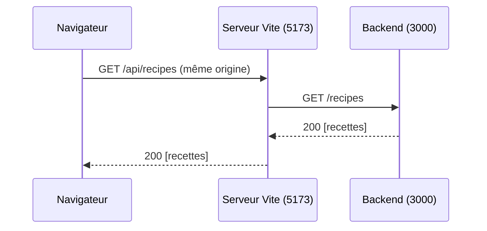
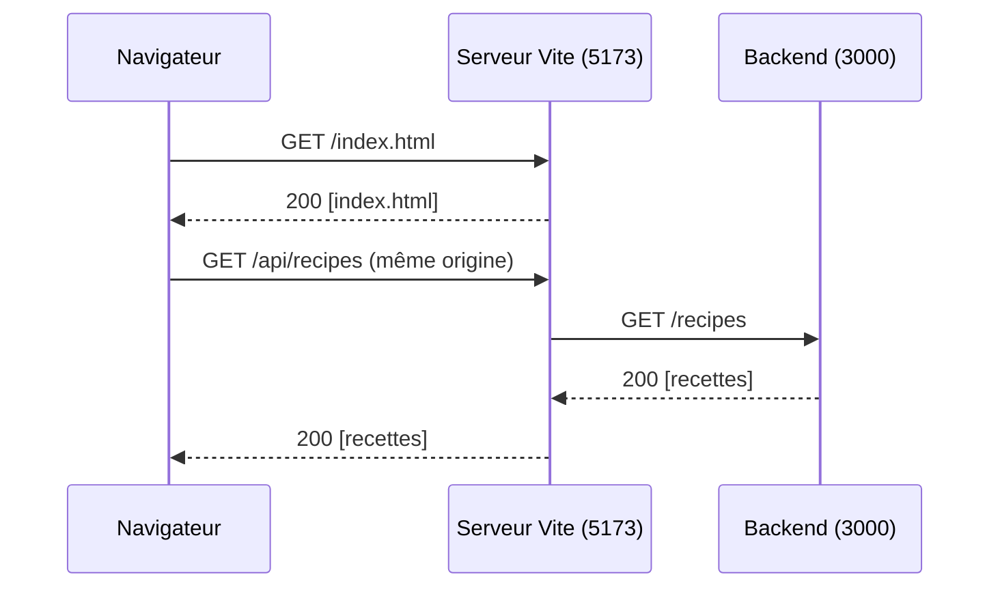
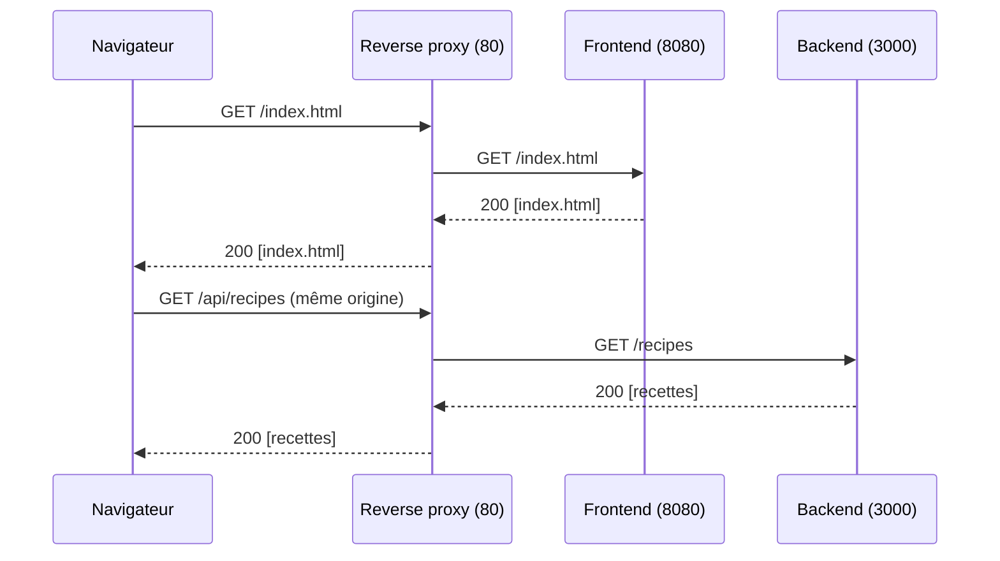

# Web 2 — Séance 22
## CORS et proxy

---

# Le problème
##

On remplace l'API de démonstration par le backend MiamMiam (port 3000) :

```ts
const API_URL = "http://localhost:3000";
```

```
Access to fetch at 'http://localhost:3000/recipes' from origin 'http://localhost:5173'
has been blocked by CORS policy: No 'Access-Control-Allow-Origin' header is present
on the requested resource.
```

Pourtant :

- Le backend fonctionne : REST Client obtient bien les recettes
- JSON Server (port 3001) fonctionnait avec le même code
- Dans le terminal du backend, la requête `[GET] /recipes` apparaît : **le serveur a répondu**

C'est le **navigateur** qui refuse de donner la réponse au JavaScript.

---

# Origine

Une **origine** est la combinaison de trois éléments d'une URL :

```
http://localhost:5173/recipes/3
└─┬┘   └───┬───┘ └┬─┘
protocole  domaine  port
```

| URL | Même origine que `http://localhost:5173` ? |
|---|---|
| `http://localhost:5173/login` | Oui : seul le chemin change |
| `http://localhost:3000/recipes` | Non : port différent |
| `https://localhost:5173/` | Non : protocole différent |
| `http://127.0.0.1:5173/` | Non : domaine différent (même machine !) |

Le frontend (5173) et le backend (3000) ont des origines **différentes**.

---

# La same-origin policy
##

Règle de sécurité appliquée par tous les navigateurs :

> Un script chargé depuis une origine ne peut pas **lire** les réponses provenant d'une autre origine, sauf si cette autre origine l'autorise.

Pourquoi ? Le navigateur envoie automatiquement les cookies d'un site avec chaque requête vers ce site.

- Vous êtes connecté à votre banque dans un onglet
- Un site malveillant, dans un autre onglet, exécute `fetch("https://ma-banque.be/comptes")`
- Le navigateur joint vos cookies de la banque à la requête
- Sans la same-origin policy, le script malveillant pourrait lire vos comptes

La règle protège **l'utilisateur du navigateur**, pas le serveur : REST Client, curl ou un autre serveur ne sont pas concernés.

---

# CORS : l'autorisation par le serveur
##

**CORS** (*Cross-Origin Resource Sharing*) : mécanisme par lequel un serveur indique au navigateur quelles origines peuvent lire ses réponses, grâce à des en-têtes HTTP.

```http
HTTP/1.1 200 OK
Content-Type: application/json
Access-Control-Allow-Origin: http://localhost:5173

[{"id":1,"title":"Pancakes moelleux", ...}]
```

- Le navigateur envoie l'en-tête `Origin: http://localhost:5173` avec la requête
- Si la réponse contient `Access-Control-Allow-Origin` avec cette origine (ou `*`), le JavaScript peut lire la réponse
- Sinon, le navigateur bloque la réponse et `fetch` rejette la Promise
- JSON Server autorise toutes les origines : il recopie l'origine de la requête dans `Access-Control-Allow-Origin`, c'est pourquoi il fonctionnait (vérifiez dans l'onglet Réseau)

---

# Requêtes préliminaires (preflight)

Pour une requête « non simple », le navigateur demande d'abord la permission avec une requête `OPTIONS`.

Une requête n'est pas simple si elle utilise notamment :

- Une méthode autre que `GET`, `HEAD` ou `POST` (`PUT`, `PATCH`, `DELETE`)
- `Content-Type: application/json`
- Un en-tête personnalisé, comme `Authorization`

```http
OPTIONS /recipes                              Réponse attendue :
Origin: http://localhost:5173                 Access-Control-Allow-Origin: http://localhost:5173
Access-Control-Request-Method: POST           Access-Control-Allow-Methods: GET, POST, PUT, DELETE
Access-Control-Request-Headers: content-type, Access-Control-Allow-Headers: Content-Type, Authorization
  authorization
```

- Si la réponse n'autorise pas la requête, la vraie requête n'est **jamais envoyée**
- Toutes les requêtes d'écriture de MiamMiam (JSON + token) sont précédées d'un preflight

---

# Solution 1 : CORS dans le backend
##

Le serveur ajoute les en-têtes CORS à ses réponses :

```ts
app.use((req, res, next) => {
  const origin = req.headers.origin;
  res.header("Access-Control-Allow-Origin", origin ?? "*");
  res.header("Vary", "Origin");
  res.header("Access-Control-Allow-Methods", "GET,POST,PUT,PATCH,DELETE,OPTIONS");
  res.header("Access-Control-Allow-Headers", "Content-Type, Authorization");

  if (req.method === "OPTIONS") {
    return res.sendStatus(204); // réponse au preflight
  }
  next();
});
```

- Il autorise **toutes** les origines (il renvoie celle de la requête)
- En production, on autorise uniquement l'origine du frontend
- Le paquet npm `cors` fournit le même middleware, configurable

---

# Solution 1 : CORS dans le backend (suite)

```bash
npm install cors
```

```ts
import cors from "cors";

app.use(cors({ origin: "http://localhost:5173" })); 
```

- Le middleware gère les preflight et les en-têtes CORS
- On peut autoriser plusieurs origines, ou toutes avec `origin: true`

---

# Solution 2 : éviter le cross-origin
##

- Si le frontend et le backend ont la **même origine**, la same-origin policy ne bloque rien et CORS est inutile.
- Le navigateur n'envoie des requêtes qu'au serveur de Vite (5173), qui les **transmet** au backend (3000).



---

# Solution 2 : éviter le cross-origin (suite)

- Le serveur de développement de Vite joue le rôle de **proxy** : il transmet les requêtes `/api` au backend
- La communication Vite &rarr; backend est une requête de serveur à serveur : pas de same-origin policy
- Le backend n'a pas besoin d'être modifié
- En production, on peut utiliser un **reverse proxy**
  - Serveur Nginx ou Apache simple
  - Reçoit toutes les requêtes, seule origine du point de vue du navigateur
  - Pour les requêtes `/api`, il transmet au backend
  - Pour les autres requêtes :
    - Soit il sert de serveur frontend lui-même
    - Soit il transmet au serveur frontend

---



---



---

# Configurer le proxy de Vite

```ts
// vite.config.ts
import { defineConfig } from "vite";
import react from "@vitejs/plugin-react";

export default defineConfig({
  plugins: [react()],
  server: {
    proxy: {
      "/api": {
        target: "http://localhost:3000",
        changeOrigin: true,
        rewrite: (path) => path.replace(/^\/api/, ""),
      },
    },
  },
});
```

- Toute requête dont le chemin commence par `/api` est transmise à `http://localhost:3000`
- `rewrite` : retire le préfixe, `/api/recipes` devient `/recipes`
- `changeOrigin` : l'en-tête `Host` est remplacé par celui du backend

---

# Pourquoi un préfixe /api ?

```ts
// services/recipes.service.ts
const API_URL = "/api"; // URL relative : même origine que la page

export const getRecipes = async (): Promise<Recipe[]> => {
  const response = await fetch(`${API_URL}/recipes`); // → http://localhost:5173/api/recipes
  // ...
};
```

Sans préfixe, les URLs de l'API et celles des pages React se confondraient :

- `http://localhost:5173/recipes/3` : la **page** de détail (React Router, séance 15)
- `http://localhost:5173/api/recipes/3` : les **données** de la recette (backend)

Le préfixe permet au serveur de Vite de savoir s'il doit renvoyer `index.html` ou transmettre la requête au backend.

---

# Et en production ?

Le proxy de Vite n'existe qu'avec `npm run dev`. Après `npm run build`, le frontend n'est plus qu'un dossier `dist/` de fichiers statiques.

Deux architectures possibles :

- **Même origine** : un serveur (Nginx, ou Express lui-même avec `express.static`) sert les fichiers de `dist/` et transmet `/api` au backend
  - Le code du frontend (`/api/...`) fonctionne sans modification
- **Origines différentes** : frontend sur `https://miammiam.be`, API sur `https://api.miammiam.be`
  - Le backend doit configurer CORS pour l'origine du frontend
  - L'URL de l'API se configure dans une variable d'environnement Vite : `import.meta.env.VITE_API_URL`

Dans ce cours, on utilise le proxy de Vite, et le backend reste inchangé.

---

# Diagnostiquer une erreur CORS
##

Dans l'onglet Réseau :

- Requête en rouge avec la mention *CORS error* : la réponse a été bloquée par le navigateur
- Requête `OPTIONS` en échec (souvent 404 : aucune route `OPTIONS` dans Express) : le preflight a été refusé, la vraie requête n'est pas partie
- Réponse sans en-tête `Access-Control-Allow-Origin` : le serveur n'a pas configuré CORS

---

# Récapitulatif Séance 22

- **Origine** — Protocole + domaine + port
- **Same-origin policy** — Le navigateur empêche un script de lire les réponses d'une autre origine
- **Protège l'utilisateur** — Les outils comme REST Client ne sont pas concernés
- **CORS** — Le serveur autorise des origines avec `Access-Control-Allow-Origin`
- **Preflight** — Requête `OPTIONS` avant les requêtes non simples (JSON, `Authorization`, `PUT`, `DELETE`)
- **Solution backend** — Middleware CORS, comme dans le projet Web 1
- **Proxy Vite** — Même origine en développement, `/api` transmis au backend avec `rewrite`
- **Production** — Même origine via un serveur, ou CORS configuré pour l'origine du frontend

**Prochaine séance** : Séance 23 — Session

---

# Exercice filé S22

1. Lancez le backend MiamMiam (`npm run demo:reset`, puis `npm run dev`) et remplacez l'URL de l'API par `http://localhost:3000` : observez l'erreur CORS dans la console, l'onglet Réseau et le terminal du backend
2. Configurez le proxy de Vite pour `/api` et utilisez `API_URL = "/api"` dans les services
3. Vérifiez que la liste, le détail et les catégories fonctionnent avec les données du backend
4. Utilisez les filtres du backend : `getRecipes` accepte un objet de filtres (`search`, `categoryId`) et les ajoute en paramètres de requête avec `URLSearchParams` ; la recherche et le filtre par catégorie de `HomePage` passent par le serveur
5. Tentez de créer une recette avec un `POST` vers `/api/recipes` : quel statut obtenez-vous, et pourquoi ?
6. **Optionnel** : dans une copie du backend, ajoutez le middleware CORS, retirez le proxy et comparez les requêtes dans l'onglet Réseau (preflight `OPTIONS`)
