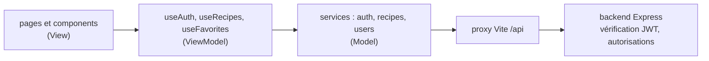

# Web 2 — Séance 24
## Fetch avec JWT

---

# Requêtes authentifiées
##

Les routes suivantes du backend sont protégées et exigent une authentification par JWT :

| Requête | Accès | Réponse en cas de succès |
|---|---|---|
| `POST /recipes` | utilisateur connecté | `201` + recette créée |
| `PUT /recipes/:id` | auteur ou admin | `204`, sans corps |
| `DELETE /recipes/:id` | auteur ou admin | `204`, sans corps |
| `GET /users/me/favorites` | utilisateur connecté | `200` + recettes favorites |
| `PUT /users/me/favorites/:recipeId` | utilisateur connecté | `204`, sans corps |
| `DELETE /users/me/favorites/:recipeId` | utilisateur connecté | `204`, sans corps |

---

# Envoyer le token
##

Le backend attend le token **tel quel** dans l'en-tête `Authorization`, comme dans les fichiers `.http` de REST Client (séance 03) :

```ts
await fetch("/api/recipes/3", {
  method: "DELETE",
  headers: { Authorization: token },
});
```

Rien d'autre ne change par rapport à la séance 21 : `fetch`, vérification de `response.ok`, lecture du corps.

Une seule question : **d'où vient le token ?** Il est dans `useAuth` (séance 23), appelé dans `App`. Il faut donc le transmettre jusqu'aux services.

---

# Un service avec token
##

```ts
// services/recipes.service.ts
export const createRecipe = async (recipe: NewRecipe, token: string): Promise<Recipe> => {
  const response = await fetch(`${API_URL}/recipes`, {
    method: "POST",
    headers: { "Content-Type": "application/json", Authorization: token },
    body: JSON.stringify(recipe),
  });
  if (response.status === 400) throw new Error("La recette est invalide");
  if (!response.ok) throw new Error(`Erreur HTTP ${response.status}`);
  const data = await response.json();
  return data as Recipe; // la recette créée, avec son id et son auteur
};

export const deleteRecipe = async (id: number, token: string): Promise<void> => {
  const response = await fetch(`${API_URL}/recipes/${id}`, {
    method: "DELETE",
    headers: { Authorization: token },
  });
  if (response.status === 403) throw new Error("Vous n'êtes pas l'auteur de cette recette");
  if (!response.ok) throw new Error(`Erreur HTTP ${response.status}`);
  // 204 : pas de corps, rien à lire (response.json() lèverait une erreur)
};
```

---

# Le token dans useRecipes
##

`App` passe le token au hook, comme une prop à un composant :

```ts
// App.tsx
const auth = useAuth();
const { recipes, addRecipe, deleteRecipe } = useRecipes(auth.token);
```

```ts
// hooks/useRecipes.ts
export const useRecipes = (token: string | null) => {
  // ... état et chargement de la séance 21 (GET /recipes ne demande pas de token)

  const addRecipe = async (newRecipe: NewRecipe): Promise<Recipe> => {
    if (!token) throw new Error("Vous devez être connecté");
    const created = await recipesService.createRecipe(newRecipe, token);
    setRecipes((prev) => [...prev, created]);
    return created;
  };
  // ...
};
```

- Un hook personnalisé peut recevoir des **paramètres**, comme toute fonction
- `addRecipe` est maintenant **asynchrone** : la page attend la réponse du serveur

---

# Mettre à jour l'interface après une requête
##

Deux stratégies pour une action de l'utilisateur (supprimer une recette) :

**Pessimiste** : attendre la confirmation du serveur, puis modifier l'état

```ts
const deleteRecipe = async (id: number) => {
  if (!token) throw new Error("Vous devez être connecté");
  await recipesService.deleteRecipe(id, token); // lève une erreur si refusé
  setRecipes((prev) => prev.filter((r) => r.id !== id));
};
```

**Optimiste** : modifier l'état immédiatement, annuler si le serveur refuse

- Interface plus réactive, mais plus complexe (sauvegarder l'ancien état, le restaurer)

Dans ce cours : stratégie **pessimiste**. L'état local reflète toujours ce que le serveur a accepté.

---

# Exemple : créer une recette
##

```tsx
// pages/AddRecipePage.tsx
const [error, setError] = useState<string | null>(null);

const handleAdd = async (newRecipe: NewRecipe) => {
  try {
    const created = await onAdd(newRecipe); // addRecipe de useRecipes
    navigate(`/recipes/${created.id}`);
  } catch (err) {
    setError(err instanceof Error ? err.message : "Impossible d'enregistrer la recette");
  }
};
```

- L'`id` et l'`authorId` viennent maintenant du **backend** : fini `Date.now()` et `authorId: 1`
- Le message affiché est celui du service (« La recette est invalide »…)

---

# Exemple : favoris sur le serveur
##

```ts
// hooks/useFavorites.ts
export const useFavorites = (token: string | null) => {
  const [favoriteIds, setFavoriteIds] = useState<number[]>([]);

  useEffect(() => {
    if (!token) return;
    usersService.getFavorites(token).then((recipes) => setFavoriteIds(recipes.map((r) => r.id)));
  }, [token]); // rechargés à chaque connexion

  const toggleFavorite = async (recipeId: number) => {
    if (!token) return;
    if (favoriteIds.includes(recipeId)) {
      await usersService.removeFavorite(recipeId, token);
      setFavoriteIds((prev) => prev.filter((id) => id !== recipeId));
    } else {
      await usersService.addFavorite(recipeId, token);
      setFavoriteIds((prev) => [...prev, recipeId]);
    }
  };

  const isFavorite = (recipeId: number) => token !== null && favoriteIds.includes(recipeId);
  return { favoriteIds, toggleFavorite, isFavorite };
};
```

---

# Architecture finale de MiamMiam



- `App` appelle chaque hook une fois et transmet le token de `useAuth` aux autres hooks
- Chaque couche a une seule responsabilité, comme dans le backend
- La sécurité est assurée par le **backend** : le frontend masque ce qui est interdit, le backend le refuse

---

# Récapitulatif Séance 24

- **Routes protégées** — `Authorization: <token>` sur chaque requête authentifiée
- **Services** — Reçoivent le token en paramètre ; un message par statut d'erreur attendu
- **204** — Pas de corps : ne pas appeler `response.json()`
- **Hooks avec paramètre** — `useRecipes(auth.token)`, `useFavorites(auth.token)`
- **Mise à jour pessimiste** — L'état local change après la confirmation du serveur
- **Données du backend** — Id, auteur et favoris viennent du serveur

**Prochaine séance** : examen blanc

---

# Exercice filé S24

1. Ajoutez le token aux services des routes protégées (`createRecipe`, `updateRecipe`, `deleteRecipe`), avec un message par statut d'erreur attendu (400, 403, 404)
2. `useRecipes` reçoit le token ; `addRecipe` et `deleteRecipe` appellent le serveur, puis mettent à jour l'état
3. Ajouter une recette : `POST /recipes`, puis navigation vers la page de la recette créée ; affichez l'erreur éventuelle (le type de `onAdd` devient `(recipe: NewRecipe) => Promise<Recipe>`)
4. Supprimer une recette : `DELETE /recipes/:id`, puis retour à la liste ; affichez l'erreur éventuelle
5. Ajoutez une page `/recipes/:id/edit`, réservée aux utilisateurs connectés, qui réutilise `RecipeForm` pré-rempli avec la recette et envoie `PUT /recipes/:id`
6. Migrez les favoris vers le serveur : `services/users.service.ts` (`getFavorites`, `addFavorite`, `removeFavorite`) et `useFavorites(token)` ; affichez une page « Mes favoris »
7. Connectez-vous avec Alice, ajoutez des favoris, puis connectez-vous avec Bob : chacun voit ses propres favoris
8. **Optionnel** : une page « Mes recettes » (`GET /recipes?authorId=...`)

---

# Web 2 : ce que vous savez faire

- **Partie 1 — Backend** : TypeScript avancé, API REST documentée, authentification JWT, mots de passe hachés, code asynchrone
- **Partie 2 — Frontend old school** : manipulation du DOM et événements
- **Partie 3 — React** : composants, props, état, formulaires, routage, effets, timers, stockage, architecture MVVM
- **Partie 4 — Liaison** : fetch, CORS et proxy, session, requêtes authentifiées

**Examen blanc** la prochaine séance, dans les conditions de l'examen :

- Conception d'un site web complet (front + back) en 2h
- Accès aux slides
- Même format en première et en deuxième session
