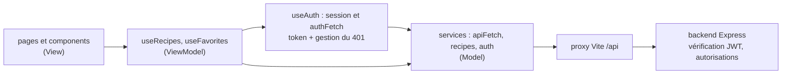

# Web 2 — Séance 24
## Fetch avec JWT

---

# Requêtes authentifiées
##

Les routes suivantes du backend sont protégées et exigent une authentification par JWT :

| Requête | Accès | Réponse en cas de succès |
|---|---|---|
| `POST /recipes` | utilisateur connecté | `201` + recette créée |
| `PUT /recipes/:id` | auteur ou admin | `204`, sans corps |
| `DELETE /recipes/:id` | auteur ou admin | `204`, sans corps |
| `GET /users/me/favorites` | utilisateur connecté | `200` + recettes favorites |
| `PUT /users/me/favorites/:recipeId` | utilisateur connecté | `204`, sans corps |
| `DELETE /users/me/favorites/:recipeId` | utilisateur connecté | `204`, sans corps |

---

# Envoyer le token
##

Le backend attend le token **tel quel** dans l'en-tête `Authorization` :

```ts
await fetch("/api/recipes/3", {
  method: "DELETE",
  headers: { Authorization: token },
});
```

Répéter ces lignes dans chaque service multiplie les oublis et les incohérences : on centralise.

---

# Une fonction centrale : apiFetch

```ts
// services/api.ts
const API_URL = "/api";

export class ApiError extends Error {
  status: number;
  constructor(status: number, message: string) {
    super(message);
    this.status = status;
  }
}

export const apiFetch = async <T>(path: string, options: RequestInit = {}, token?: string | null): Promise<T> => {
  const headers = new Headers(options.headers);
  if (options.body) headers.set("Content-Type", "application/json");
  if (token) headers.set("Authorization", token);

  const response = await fetch(`${API_URL}${path}`, { ...options, headers });

  if (!response.ok) throw new ApiError(response.status, `Erreur HTTP ${response.status}`);
  if (response.status === 204) return undefined as T; // pas de corps à lire

  const data = await response.json();
  return data as T;
};
```


---

# Des services plus simples

```ts
// services/recipes.service.ts
import { apiFetch } from "./api";
import type { NewRecipe, Recipe } from "../models/recipe";

export const getRecipes = () => apiFetch<Recipe[]>("/recipes");

export const createRecipe = (recipe: NewRecipe, token: string) =>
  apiFetch<Recipe>("/recipes", { method: "POST", body: JSON.stringify(recipe) }, token);

export const updateRecipe = (id: number, recipe: NewRecipe, token: string) =>
  apiFetch<void>(`/recipes/${id}`, { method: "PUT", body: JSON.stringify(recipe) }, token);

export const deleteRecipe = (id: number, token: string) =>
  apiFetch<void>(`/recipes/${id}`, { method: "DELETE" }, token);
```

- Une ligne par route de l'API, qui se lit comme la documentation
- Le service ne sait pas **d'où** vient le token : il le reçoit en paramètre

---

# Réagir à un token expiré
##

Un token peut expirer **pendant** l'utilisation de l'application : la requête suivante reçoit `401`.

Réaction attendue, pour **toutes** les requêtes authentifiées :

1. Oublier le token et l'utilisateur (`logout`)
2. Ramener l'utilisateur à la page de connexion

Le 2e point est **automatique** : les routes protégées par `RequireAuth` (séance 23) affichent `Navigate` dès que `user` devient `null`. L'interface découle de l'état.

Pour centraliser le 1er point, la fonction qui envoie les requêtes doit connaître le `token` **et** pouvoir appeler `logout` : les deux se trouvent dans `useAuth`. On y ajoute donc une fonction `authFetch`.

---

# authFetch : requêtes authentifiées

```ts
// hooks/useAuth.ts (suite)
const authFetch = async <T>(path: string, options: RequestInit = {}): Promise<T> => {
  try {
    return await apiFetch<T>(path, options, token);
  } catch (err) {
    if (err instanceof ApiError && err.status === 401) {
      logout(); // session expirée : RequireAuth redirige vers /login
    }
    throw err; // l'appelant affiche un message adapté
  }
};

return { user, token, loading, login, register, logout, authFetch };
```

- `authFetch` est créée dans le hook : elle voit le `token` courant et peut appeler `logout`
- L'appelant n'a plus à passer le token : `authFetch<Recipe>("/recipes", { method: "POST", ... })`
- C'est l'équivalent d'un **intercepteur** : un traitement commun à toutes les réponses

```ts
// types.ts  ->  type de la fonction authFetch, pour pouvoir la passer en paramètre à d'autres hooks
export type AuthFetch = <T>(path: string, options?: RequestInit) => Promise<T>;
```

---

# Tout se branche dans App

```tsx
const App = () => {
  const auth = useAuth();
  const { recipes, addRecipe, deleteRecipe } = useRecipes(auth.authFetch);
  const { isFavorite, toggleFavorite } = useFavorites(auth.user, auth.refreshUser, auth.authFetch);

  return (
    <BrowserRouter>
      <Routes>{/* routes de la séance 23 */}</Routes>
    </BrowserRouter>
  );
};
```

- Un hook personnalisé peut recevoir des **paramètres**, comme toute fonction
- `useRecipes` ne sait pas d'où vient `authFetch`, comme le service ne savait pas d'où venait le token
- Chaque hook est appelé **une seule fois**, dans `App` (séance 19) ; les pages reçoivent données et actions en props, et ne voient jamais le token

---

# Mettre à jour l'interface après une requête
##

Deux stratégies pour une action de l'utilisateur (supprimer une recette) :

**Pessimiste** : attendre la confirmation du serveur, puis modifier l'état

```ts
const removeRecipe = async (id: number) => {
  await authFetch<void>(`/recipes/${id}`, { method: "DELETE" }); // lève une erreur si refusé
  setRecipes((prev) => prev.filter((r) => r.id !== id));
};
```

**Optimiste** : modifier l'état immédiatement, annuler si le serveur refuse

- Interface plus réactive, mais plus complexe (sauvegarder l'ancien état, le restaurer)

Dans ce cours : stratégie **pessimiste**. L'état local reflète toujours ce que le serveur a accepté.

---

# Exemple : créer une recette

```ts
// hooks/useRecipes.ts
export const useRecipes = (authFetch: AuthFetch) => {
  // ...
  const addRecipe = async (newRecipe: NewRecipe): Promise<Recipe> => {
    const created = await authFetch<Recipe>("/recipes", {
      method: "POST",
      body: JSON.stringify(newRecipe),
    });
    setRecipes((prev) => [...prev, created]); // la recette avec l'id et l'auteur du backend
    return created;
  };
  // ...
};
```

```tsx
// pages/AddRecipePage.tsx
const handleAdd = async (newRecipe: NewRecipe) => {
  try {
    const created = await addRecipe(newRecipe);
    navigate(`/recipes/${created.id}`);
  } catch (err) {
    setError(err instanceof ApiError && err.status === 400
      ? "La recette est invalide"
      : "Impossible d'enregistrer la recette");
  }
};
```

---

# Exemple : favoris sur le serveur
##

En séance 17, les favoris étaient dans le `localStorage` : propres à un navigateur. Le backend les stocke par **utilisateur**.

L'utilisateur renvoyé par `GET /auth/me` contient déjà ses favoris (`user.favorites`) : ils sont **déduits** de `user`, pas copiés dans un nouvel état.

```ts
// hooks/useFavorites.ts
// refreshUser : fonction de useAuth qui redemande GET /auth/me et met à jour user
export const useFavorites = (user: User | null, refreshUser: () => Promise<void>, authFetch: AuthFetch) => {
  const favoriteIds = user?.favorites ?? []; // valeur dérivée (séance 14)

  const toggleFavorite = async (recipeId: number) => {
    const method = favoriteIds.includes(recipeId) ? "DELETE" : "PUT";
    await authFetch<void>(`/users/me/favorites/${recipeId}`, { method });
    await refreshUser(); // user reçoit la nouvelle liste du serveur
  };

  return { favoriteIds, toggleFavorite, isFavorite: (id: number) => favoriteIds.includes(id) };
};
```

- Une seule source de vérité : `user` de `useAuth`, lui-même synchronisé avec le serveur
- Grâce à MVVM (séance 19), les composants qui utilisent `useFavorites` ne changent pas

---

# Architecture finale de MiamMiam



- Chaque couche a une seule responsabilité, comme dans le backend
- La sécurité est assurée par le **backend** : le frontend masque ce qui est interdit, le backend le refuse

---

# Récapitulatif Séance 24

- **Routes protégées** — `Authorization: <token>` sur chaque requête authentifiée
- **apiFetch** — Préfixe, en-têtes, `Content-Type`, `204` et erreurs traités en un seul endroit
- **ApiError** — Erreur qui transporte le statut HTTP
- **Fonction générique** — `apiFetch<T>` retourne le type demandé par l'appelant
- **authFetch** — Fonction de `useAuth` qui ajoute le token et réagit au `401`
- **App** — Appelle chaque hook une fois et passe `authFetch` aux autres hooks
- **Mise à jour pessimiste** — L'état local change après la confirmation du serveur
- **Données du backend** — Id, auteur et favoris viennent du serveur

**Prochaine séance** : examen blanc

---

# Exercice filé S24

1. Créez `services/api.ts` avec `ApiError` et `apiFetch`, et simplifiez les services existants
2. Ajoutez `authFetch` à `useAuth` et passez-la en paramètre à `useRecipes`
3. Ajouter une recette : `POST /recipes`, puis navigation vers la page de la recette créée
4. Supprimer une recette : `DELETE /recipes/:id` ; affichez un message si le serveur répond `403`
5. Ajoutez une page `/recipes/:id/edit`, protégée, qui réutilise `RecipeForm` pré-rempli avec la recette et envoie `PUT /recipes/:id`
6. Ajoutez `refreshUser` à `useAuth` et migrez les favoris vers le serveur ; affichez une page « Mes favoris » (`GET /users/me/favorites`)
7. Testez l'expiration : modifiez le token dans le `localStorage`, puis ajoutez une recette : vous devez être renvoyé vers la page de connexion
8. **Optionnel** : une page « Mes recettes » (`GET /recipes?authorId=...`)

---

# Web 2 : ce que vous savez faire

- **Partie 1 — Backend** : TypeScript avancé, API REST documentée, authentification JWT, mots de passe hachés, code asynchrone
- **Partie 2 — Frontend old school** : manipulation du DOM et événements
- **Partie 3 — React** : composants, props, état, formulaires, routage, effets, timers, stockage, architecture MVVM
- **Partie 4 — Liaison** : fetch, CORS et proxy, session, requêtes authentifiées

**Examen blanc** la semaine prochaine, dans les conditions de l'examen :

- Conception d'un site web complet (front + back) en 2h
- Accès aux slides
- Même format en première et en deuxième session
